# **全 API エンドポイント一覧（v1）**

---

# 1. **認証 / セキュリティ (`/auth`)**

```
POST   /api/v1/auth/login
POST   /api/v1/auth/mfa/verify-login
POST   /api/v1/auth/logout
GET    /api/v1/auth/me
POST   /api/v1/auth/change-password
POST   /api/v1/auth/mfa/setup-init
POST   /api/v1/auth/mfa/setup-verify
```

---

# 2. **パスワードリセット（ユーザー / 管理者）**

```
POST   /api/v1/password-reset-requests
GET    /api/v1/admin/password-reset-requests
PATCH  /api/v1/admin/password-reset-requests/{requestId}

POST   /api/v1/employees/{employeeId}/reset-password
```

---

# 3. **従業員 / 組織（Employees / Facilities）**

```
GET    /api/v1/employees
GET    /api/v1/employees/{employeeId}
POST   /api/v1/employees           (管理者)
PATCH  /api/v1/employees/{employeeId}     (管理者)
DELETE /api/v1/employees/{employeeId}     (管理者)

GET    /api/v1/facilities
GET    /api/v1/facilities/{facilityId}
POST   /api/v1/facilities          (管理者)
PATCH  /api/v1/facilities/{facilityId}    (管理者)
DELETE /api/v1/facilities/{facilityId}    (管理者)
```

---

# 4. **評価割り当て（Assignments）**

```
GET    /api/v1/assignments
GET    /api/v1/assignments/{assignmentId}
POST   /api/v1/assignments                     (施設長 / 管理者)
PATCH  /api/v1/assignments/{assignmentId}      (施設長 / 管理者)
DELETE /api/v1/assignments/{assignmentId}      (施設長 / 管理者)
```

---

# 5. **評価タスク（Evaluation Tasks）**

```
GET    /api/v1/evaluation-tasks
GET    /api/v1/evaluation-tasks/{taskId}
PATCH  /api/v1/evaluation-tasks/{taskId}   // 評価進行・ステータス更新
```

---

# 6. **評価結果（Evaluation Results = 個票）**

```
GET    /api/v1/evaluation-results
GET    /api/v1/evaluation-results/{resultId}
PATCH  /api/v1/evaluation-results/{resultId}     // 評価者の編集
POST   /api/v1/evaluation-results/{resultId}/submit   // 次段階へ提出
```

---

# 7. **質問集・評価フォーム（Question Master / Evaluation Forms）**

```
GET    /api/v1/question-master
POST   /api/v1/question-master                 (管理者)
PATCH  /api/v1/question-master/{questionId}    (管理者)
DELETE /api/v1/question-master/{questionId}    (管理者)

GET    /api/v1/evaluation-forms
GET    /api/v1/evaluation-forms/{formId}
POST   /api/v1/evaluation-forms                (管理者)
PATCH  /api/v1/evaluation-forms/{formId}       (管理者)
DELETE /api/v1/evaluation-forms/{formId}       (管理者)
```

---

# 8. **フィードバック（Feedbacks = 被考課者 & 評価者の面談票/コメント）**

```
GET    /api/v1/feedbacks                          // 被考課者・評価者 共通
GET    /api/v1/feedbacks/{feedbackId}
PATCH  /api/v1/feedbacks/{feedbackId}/self-sheet   // 被考課者が面談票記入
PATCH  /api/v1/feedbacks/{feedbackId}/manager-comment  // 面談者がコメント記入
PATCH  /api/v1/feedbacks/{feedbackId}/acknowledge  // 被考課者が内容確認
```

---

# 9. **評価進捗（Progress）**

```
GET    /api/v1/progress/my                 // 自分が評価者として抱えるタスク
GET    /api/v1/progress/self-evaluation    // 被考課者としての進捗
GET    /api/v1/progress/facility           // 施設長用（施設全体の進捗）
GET    /api/v1/progress/overview           // 管理者用（全社進捗）
```

---

# 10. **お知らせ（Notices）**

```
GET    /api/v1/notices
GET    /api/v1/notices/{noticeId}
POST   /api/v1/notices                     (管理者)
PATCH  /api/v1/notices/{noticeId}          (管理者)
DELETE /api/v1/notices/{noticeId}          (管理者)

POST   /api/v1/notices/{noticeId}/read     // 読んだマーク
```

---

# 11. **ログイン許可 IP ポリシー（Login IP Policies）**

```
GET    /api/v1/login-ip-policies                (管理者)
POST   /api/v1/login-ip-policies                (管理者)
PATCH  /api/v1/login-ip-policies/{policyId}     (管理者)
DELETE /api/v1/login-ip-policies/{policyId}     (管理者)
```

---

# 12. **集計（Site Results）**

```
GET    /api/v1/site-results
GET    /api/v1/site-results/{facilityId}
```

---

# 13. **分析（Analysis）**

```
GET    /api/v1/analysis/score-distribution
GET    /api/v1/analysis/question-stats
GET    /api/v1/analysis/histories   // 過年度比較など
```

---

# 14. **ダッシュボード（Dashboard）**

```
GET    /api/v1/dashboard/home
```

---

# 15. **監査ログ（Audit Logs）**

```
GET    /api/v1/audit-logs
GET    /api/v1/audit-logs/{logId}
GET    /api/v1/audit-logs/my    // 任意（自分の操作履歴）
```

---

# 16. **エクスポート（Exports）**

```
GET    /api/v1/exports/evaluation-results
GET    /api/v1/exports/feedbacks
GET    /api/v1/exports/site-results
```

---

# 17. **（任意）マスタ類**

必要に応じて追加される可能性あり：

```
GET    /api/v1/job-types
GET    /api/v1/grades
GET    /api/v1/departments
```

---

# **総括**

上記で **人事考課システムとして必要なあらゆる機能の API が網羅**されています。

* 認証／権限制御（auth, login-ip-policies）
* 従業員・組織（employees, facilities）
* 評価ワークフロー（assignments, tasks, results）
* フィードバック（feedbacks）
* 進捗（progress）
* 通知（notices）
* ダッシュボード（dashboard）
* 集計・分析（site-results, analysis）
* ログ管理（audit-logs）
* エクスポート（exports）

これで **バックエンド API 群の全体像として完成形** と言えます。

---


```mermaid
erDiagram
    %% ============= 基本マスタ =============

    EMPLOYEES {
        uuid id
        string employee_code
        string name
        uuid facility_id
        string grade
        string job_type
        boolean is_admin
        boolean is_facility_head
        boolean is_evaluator
        boolean is_active
    }

    FACILITIES {
        uuid id
        string code
        string name
        uuid parent_id
        boolean is_active
    }

    PERIODS {
        uuid id
        string code
        string name
        date start_date
        date end_date
        date first_stage_due_date
        date second_stage_due_date
        date final_stage_due_date
        string status
    }

    %% ============= 質問マスタ・フォーム =============

    EVALUATION_QUESTIONS {
        uuid id
        string code
        string section_code
        string text
        string description
        int max_score
        float weight
        boolean is_active
    }

    EVALUATION_FORMS {
        uuid id
        string name
        uuid period_id
        string min_grade
        string max_grade
        string job_type
        boolean is_active
    }

    EVALUATION_FORM_QUESTIONS {
        uuid id
        uuid form_id
        uuid question_id
        int section_order
        int question_order
        boolean is_required
        float weight_override
    }

    %% ============= 割り当て・タスク・評価結果 =============

    ASSIGNMENTS {
        uuid id
        uuid period_id
        uuid employee_id
        uuid facility_id
        uuid first_evaluator_id
        uuid second_evaluator_id
        uuid final_evaluator_id
        boolean is_active
    }

    EVALUATION_TASKS {
        uuid id
        uuid assignment_id
        uuid period_id
        uuid evaluator_id
        string stage
        string status
        date due_date
        datetime submitted_at
    }

    EVALUATION_RESULTS {
        uuid id
        uuid period_id
        uuid employee_id
        uuid facility_id
        uuid form_id
        float overall_score
        string overall_grade
        string status
        datetime finalized_at
    }

    EVALUATION_RESULT_SECTIONS {
        uuid id
        uuid result_id
        string section_code
        string evaluator_role
        uuid evaluator_id
        float total_score
        string comment
    }

    EVALUATION_RESULT_ITEMS {
        uuid id
        uuid section_id
        uuid question_id
        float score
        string comment
    }

    %% ============= フィードバック =============

    FEEDBACKS {
        uuid id
        uuid period_id
        uuid employee_id
        uuid result_id
        string self_sheet_answers_json
        string self_sheet_status
        string manager_comment
        uuid manager_comment_author_id
        datetime manager_comment_published_at
        datetime acknowledged_at
    }

    %% ============= 進捗・集計 =============

    SITE_RESULTS {
        uuid id
        uuid period_id
        uuid facility_id
        int employee_count
        float avg_score
        float median_score
        float stddev_score
        float grade_share_s
        float grade_share_a
        float grade_share_b
        float grade_share_c
    }

    %% ============= お知らせ =============

    NOTICES {
        uuid id
        string title
        string body
        string level
        string category
        uuid period_id
        string audience_type
        datetime publish_at
        datetime expire_at
        string status
        boolean pinned
        uuid created_by_id
    }

    NOTICE_READS {
        uuid id
        uuid notice_id
        uuid employee_id
        datetime read_at
    }

    NOTICE_TARGET_FACILITIES {
        uuid id
        uuid notice_id
        uuid facility_id
    }

    NOTICE_TARGET_EMPLOYEES {
        uuid id
        uuid notice_id
        uuid employee_id
    }

    %% ============= ログイン IP ポリシー =============

    LOGIN_IP_POLICIES {
        uuid id
        string name
        string description
        string scope_type
        string allow_mode
        string ip_cidrs_text
        boolean is_active
        datetime valid_from
        datetime valid_to
        uuid created_by_id
    }

    LOGIN_IP_POLICY_FACILITIES {
        uuid id
        uuid policy_id
        uuid facility_id
    }

    LOGIN_IP_POLICY_EMPLOYEES {
        uuid id
        uuid policy_id
        uuid employee_id
    }

    %% ============= パスワードリセット / MFA =============

    PASSWORD_RESET_REQUESTS {
        uuid id
        string employee_code
        string office_id
        uuid employee_id
        string status
        string note
        string admin_note
        datetime created_at
        datetime processed_at
        uuid processed_by_id
    }

    USER_MFA_SETTINGS {
        uuid id
        uuid employee_id
        boolean mfa_enabled
        string totp_secret
        datetime created_at
        datetime updated_at
    }

    %% ============= 監査ログ =============

    AUDIT_LOGS {
        uuid id
        datetime timestamp
        uuid actor_employee_id
        string actor_ip
        string action
        string entity_type
        string entity_id
        uuid facility_id
        string metadata_json
    }

    %% ============= リレーション定義 =============

    FACILITIES ||--o{ EMPLOYEES : has
    FACILITIES ||--o{ ASSIGNMENTS : assignment_facility
    FACILITIES ||--o{ EVALUATION_RESULTS : result_facility
    FACILITIES ||--o{ SITE_RESULTS : aggregated_at
    FACILITIES ||--o{ NOTICE_TARGET_FACILITIES : notice_to
    FACILITIES ||--o{ LOGIN_IP_POLICY_FACILITIES : ip_policy_for

    EMPLOYEES ||--o{ ASSIGNMENTS : is_target
    EMPLOYEES ||--o{ EVALUATION_TASKS : as_evaluator
    EMPLOYEES ||--o{ EVALUATION_RESULT_SECTIONS : as_evaluator
    EMPLOYEES ||--o{ FEEDBACKS : as_target
    EMPLOYEES ||--o{ NOTICE_READS : reads
    EMPLOYEES ||--o{ NOTICE_TARGET_EMPLOYEES : notice_to
    EMPLOYEES ||--o{ LOGIN_IP_POLICY_EMPLOYEES : ip_policy_for
    EMPLOYEES ||--o{ PASSWORD_RESET_REQUESTS : processed_by
    EMPLOYEES ||--o{ USER_MFA_SETTINGS : mfa_setting
    EMPLOYEES ||--o{ AUDIT_LOGS : as_actor
    EMPLOYEES ||--o{ NOTICES : created_notices

    PERIODS ||--o{ ASSIGNMENTS : for_period
    PERIODS ||--o{ EVALUATION_TASKS : for_period
    PERIODS ||--o{ EVALUATION_RESULTS : for_period
    PERIODS ||--o{ FEEDBACKS : for_period
    PERIODS ||--o{ SITE_RESULTS : for_period
    PERIODS ||--o{ NOTICES : related_to

    EVALUATION_FORMS ||--o{ EVALUATION_FORM_QUESTIONS : has_questions
    EVALUATION_QUESTIONS ||--o{ EVALUATION_FORM_QUESTIONS : used_in_forms

    ASSIGNMENTS ||--o{ EVALUATION_TASKS : has_tasks
    ASSIGNMENTS ||--o{ EVALUATION_RESULTS : produces_result

    EVALUATION_RESULTS ||--o{ EVALUATION_RESULT_SECTIONS : has_sections
    EVALUATION_RESULT_SECTIONS ||--o{ EVALUATION_RESULT_ITEMS : has_items
    EVALUATION_QUESTIONS ||--o{ EVALUATION_RESULT_ITEMS : answered_question

    EVALUATION_RESULTS ||--|| FEEDBACKS : one_feedback

    NOTICES ||--o{ NOTICE_READS : is_read_by
    NOTICES ||--o{ NOTICE_TARGET_FACILITIES : target_facility
    NOTICES ||--o{ NOTICE_TARGET_EMPLOYEES : target_employee

    LOGIN_IP_POLICIES ||--o{ LOGIN_IP_POLICY_FACILITIES : scoped_to_facility
    LOGIN_IP_POLICIES ||--o{ LOGIN_IP_POLICY_EMPLOYEES : scoped_to_employee

```


# `/auth`リソース
## 1.全体図
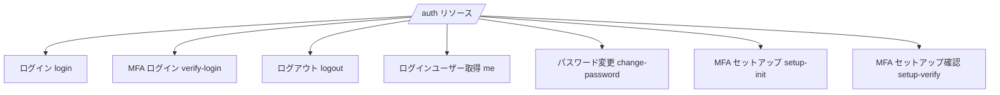
## 2.ユースケース
### 2-1.通常ログイン
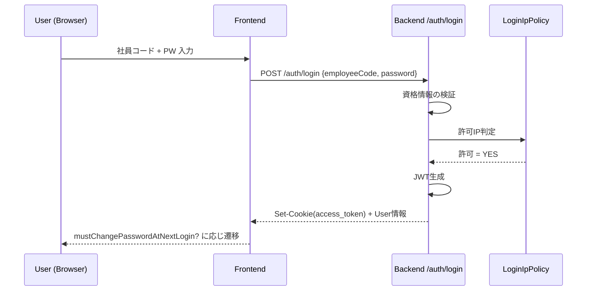
### 2-2.MFA必須ログイン
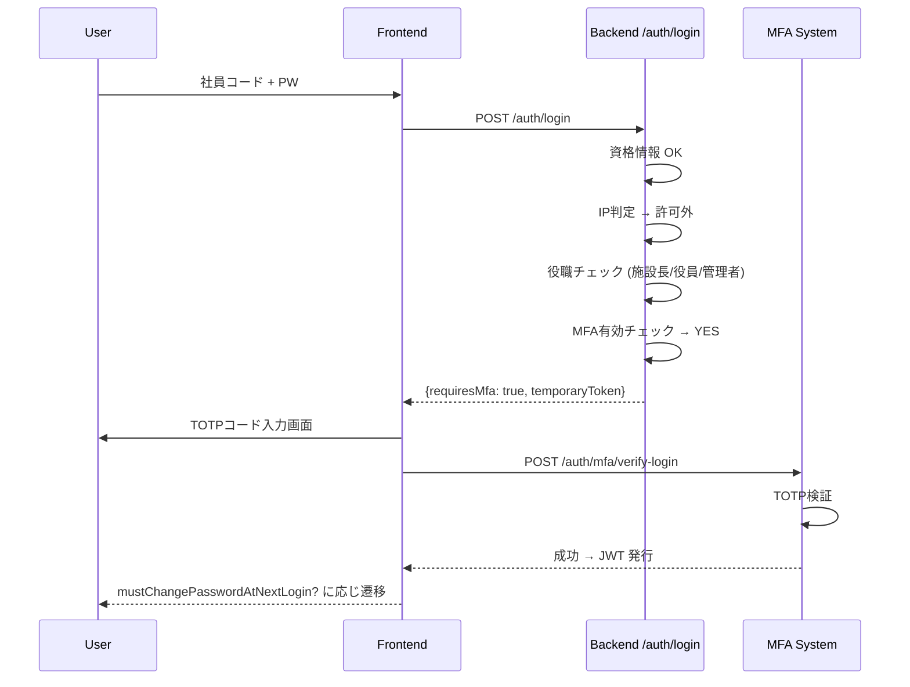
### 2-3.MFAセットアップ
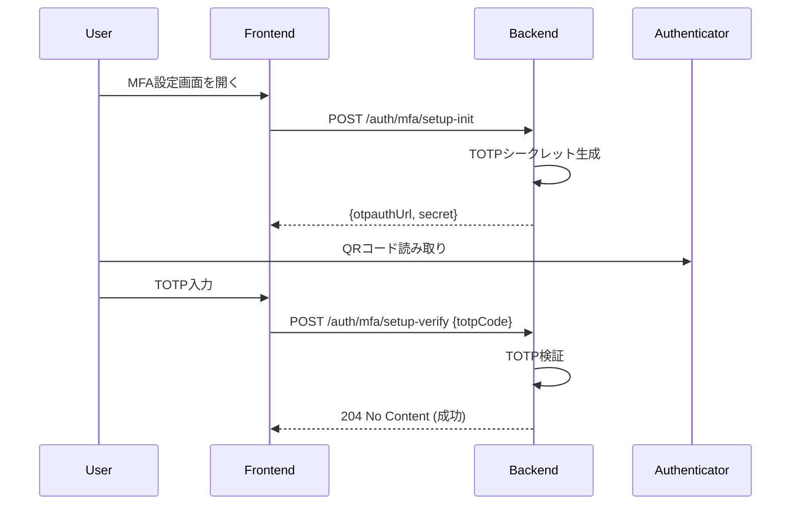
### 2-4.パスワード変更
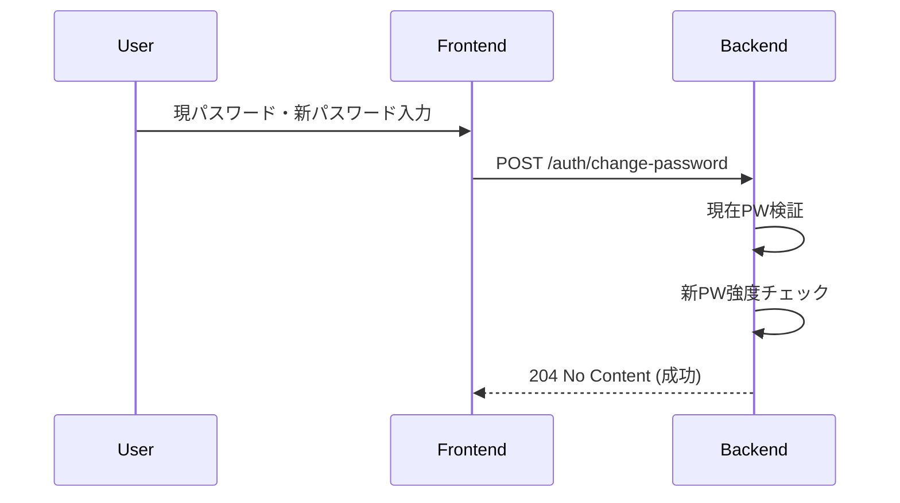

## 3.API I/O
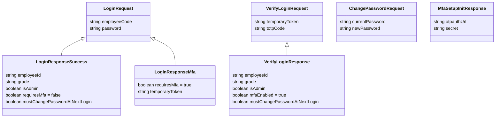
## 4.エラーレスポンス
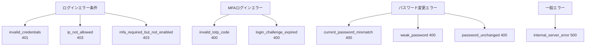

## 5.リクエスト全体フロー
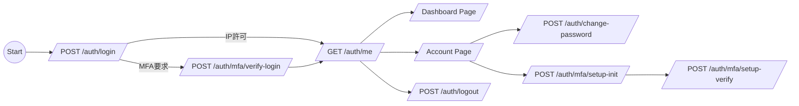


# `/password-reset-requests`&`/admin/password-reset-requests`リソース
## 1.全体図
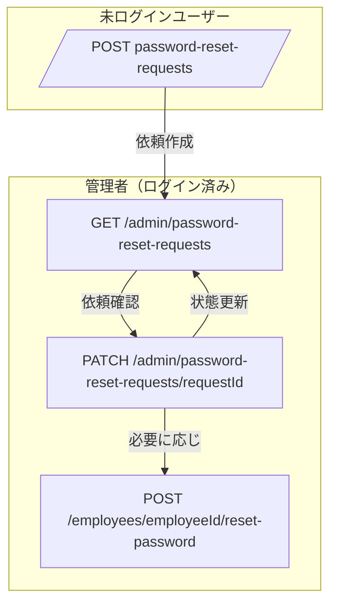

## 2.ユースケース
### 2-1.未ログイン従業員がパスワードリセットを依頼
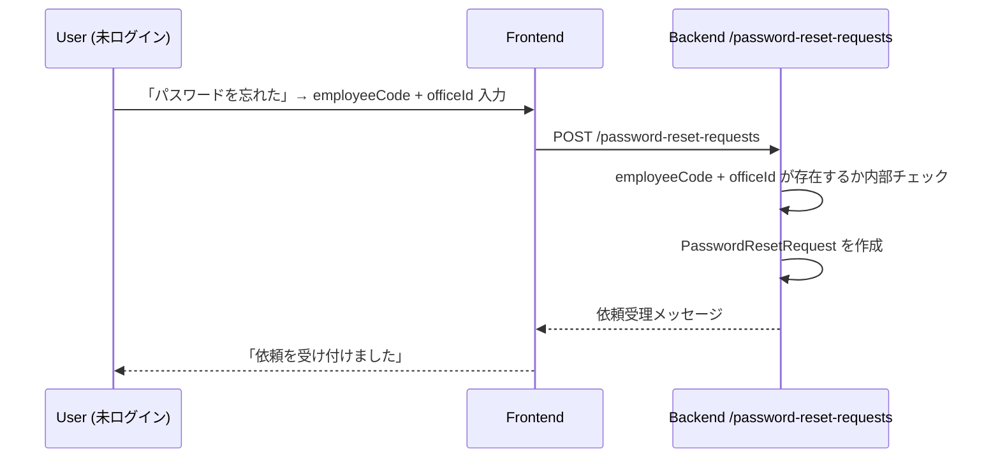

### 2-2.管理者がリセット依頼を処理する
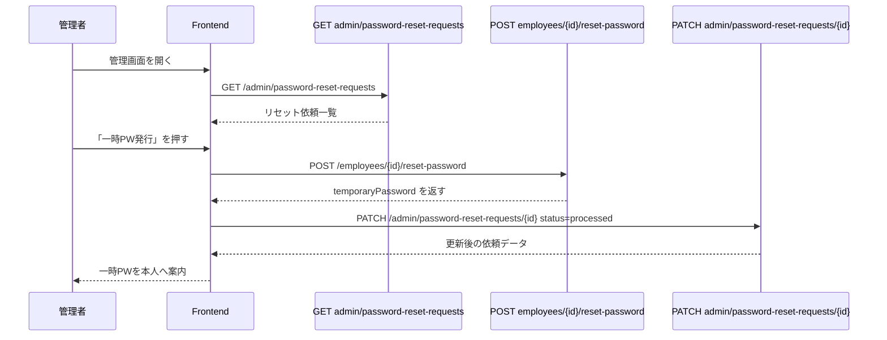

## 3.APIモデル構造
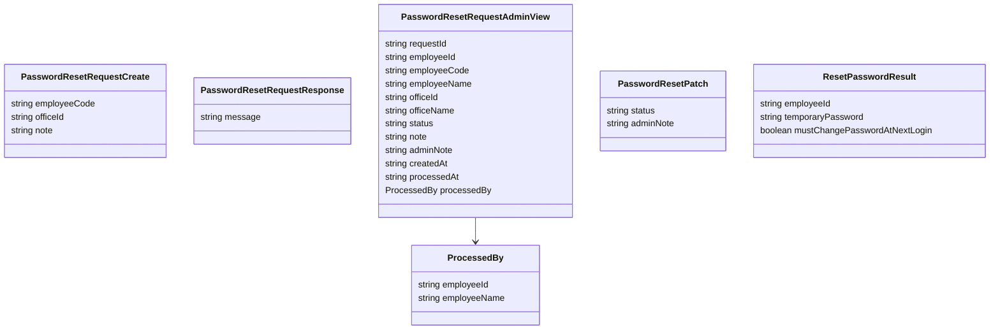

## 4.エラー遷移図
```mermaid
flowchart TD

    A[POST /password-reset-requests] --> B1[invalid_input 400<br>社員コード/事業所が空]
    A --> B2[too_many_reset_requests 429<br>短時間の連続リクエスト]
    A --> B3[internal_server_error 500]

    C[GET /admin/password-reset-requests] --> D1[not_authenticated 401]
    C --> D2[permission_denied 403]

    E[PATCH /admin/password-reset-requests/id] --> F1[not_authenticated 401]
    E --> F2[permission_denied 403]
    E --> F3[password_reset_request_not_found 404]
    E --> F4[invalid_status_transition 400<br>処理済みは再更新不可]
    E --> F5[invalid_input 400]
    E --> F6[internal_server_error 500]

    G[POST /employees/employeeId/reset-password] --> H1[not_authenticated 401]
    G --> H2[permission_denied 403]
    G --> H3[employee_not_found 404]
    G --> H4[employee_disabled 403]
    G --> H5[too_many_password_resets 429]
    G --> H6[internal_server_error 500]
```

## 5.全体フロー
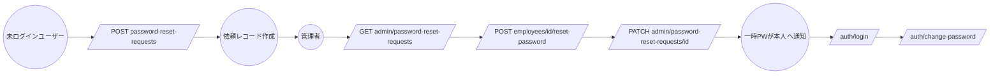


